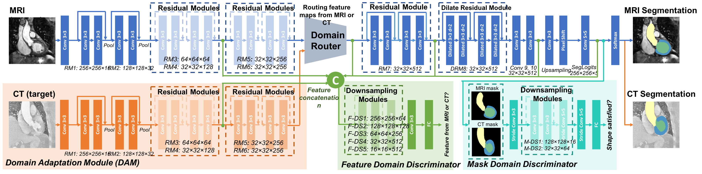

# Medical Cross-Modality Domain Adaptation (Med-CMDA)

Here are implementations for paper: <br />

**PnP-AdaNet: Plug-and-Play Adversarial Domain Adaptation Network with a Benchmark at Cross-modality Cardiac Segmentation.** (https://arxiv.org/abs/1812.07907) (long version)
 
**Unsupervised Cross-Modality Domain Adaptation of ConvNets for Biomedical Image Segmentations with Adversarial Loss, IJCAI, pp. 691-697, 2018.** (https://arxiv.org/abs/1804.10916) (short version)



### Introduction

Deep convolutional networks have demonstrated the state-of-the-art performance on various medical image computing tasks. However, the generalization capability of deep models on test data with different distributions remain as a major challenge. 
In this project, we tackle an interesting problem setting of unsupervised domain adaptation between CT and MRI, by proposing a plug-and-play adversarial domain adaptation network to align feature spaces of both domains presenting significant domain shift.

### Usage

#### 0. Packages

```
nibabel==2.1.0
nilearn==0.3.1
numpy==1.13.3
tensorflow-gpu==1.4.0 
python 2.7

(Note: other tf versions not tested, and please notify us if it also works :0)

-Updated on Mar 2020: Our user friendly confirmed that TensorFlow 1.6 with CUDA 10.0 also works.
```

#### 1. Data preprocessing

The original data of cardiac 20 CT and 20 MR images come from 
 [MMWHS Challenge](http://www.sdspeople.fudan.edu.cn/zhuangxiahai/0/mmwhs/), with the original data release license also applies to this project. <br>

The pre-processed and augmented training data repository can be downloaded [here](https://drive.google.com/file/d/1m9NSHirHx30S8jvN0kB-vkd7LL0oWCq3/view?usp=sharing), in the form of tfrecord for direct load. The testing CT data can be downloaded [here](https://drive.google.com/file/d/1SJM3RluT0wbR9ud_kZtZvCY0dR9tGq5V/view?usp=sharing), in the form of .nii with heart region cropped. <br>
The same data is also used for our [SIFA](https://github.com/cchen-cc/SIFA) paper.

Briefly, the images were 1. cropped centering at the heart region, with four cardiac substructures selected for segmentation considering mutual visibility in 2D view; 2. for each 3D cropped image top 2/% of its intensity histogram was cut off for alleviating artifacts; 3. each 3D image was then normalized to zero-mean, unit standard diviation; 4. 2D coronal slices were sampled with data augmentation. <br>

To adapt a segmenter from MR to CT, use: <br>
ct_train_tfs: training slices from 14 cases, 600 slices each, 8400 slices in total. <br>
ct_val_tfs: validation slices from 2 cases, 600 slices each. 1200 slices in total. <br>
mr_train_tfs: training slices from 16 cases, 600 slices each, 9600 slices in total. <br>
mr_val:tfs: validation slices from 4 cases, 600 slices each, 2400 slices in total. <br>
_Since we are doing MR to CT adaptation, we don't need a real MR testing set_ <br>

For the ease of training, after data augmentation, training samples are expected to be written into `tfrecord` with the following format:
```python
feature = {
            # image size, dimensions of 3 consecutive slices
            'dsize_dim0': tf.FixedLenFeature([], tf.int64), # 256
            'dsize_dim1': tf.FixedLenFeature([], tf.int64), # 256
            'dsize_dim2': tf.FixedLenFeature([], tf.int64), # 3
            # label size, dimension of the middle slice
            'lsize_dim0': tf.FixedLenFeature([], tf.int64), # 256
            'lsize_dim1': tf.FixedLenFeature([], tf.int64), # 256
            'lsize_dim2': tf.FixedLenFeature([], tf.int64), # 1
            # image slices of size [256, 256, 3]
            'data_vol': tf.FixedLenFeature([], tf.string),
            # label slice of size [256, 256, 1]
            'label_vol': tf.FixedLenFeature([], tf.string)}
```

#### 2. Training base segmentation network

Run `train_segmenter.py`, where training configurations are specified.  

This calls `source_segmenter.py`, where network structure and training function are defined.

#### 3. Training adversarial domain adaptation

##### 3.1 Warming-up the discriminator

To obtain a good initial estimation of Wasserstein distances between feature maps of two domains, we first pre-train the feature domain discriminator. In order to do this, run

`python train_gan.py --phase pre-train`

#### 3.2 Training adversarial domain adaptation

After warming the discriminator up, we can then jointly train the feature domain discriminator and the domain adaptation module (generator). To do this, run

`python train_gan.py --phase train-gan`

The experiment configurations can be found in `train_gan.py`.  It calls `adversarial.py`, where network structures and training functions are defined.

#### 4. Evaluation

The evaluation code has been released with our SIFA repo, please refer to [here](https://github.com/cchen-cc/SIFA/blob/master/evaluate.py) 

#### 5. Citations

If you make use of the code, please cite the paper in resulting publications.

```
@inproceedings{dou2018unsupervised,
  title={Unsupervised cross-modality domain adaptation of convnets for biomedical image segmentations with adversarial loss},
  author={Dou, Qi and Ouyang, Cheng and Chen, Cheng and Chen, Hao and Heng, Pheng-Ann},
  booktitle={Proceedings of the 27th International Joint Conference on Artificial Intelligence (IJCAI)},
  pages={691--697},
  year={2018}
}

or

@article{dou2018pnp,
  title={PnP-AdaNet: Plug-and-play adversarial domain adaptation network with a benchmark at cross-modality cardiac segmentation},
  author={Dou, Qi and Ouyang, Cheng and Chen, Cheng and Chen, Hao and Glocker, Ben and Zhuang, Xiahai and Heng, Pheng-Ann},
  journal={arXiv preprint arXiv:1812.07907},
  year={2018}
}
```

#### 6. Acknowledgements

Special thanks to [Ryan Neph](https://github.com/ryanneph) for the [PyMedImage](https://github.com/ryanneph/PyMedImage) package, which was used for debugging in the original project.

### Contact

General questions, please email qi.dou@imperial.ac.uk (Qi Dou) and c.ouyang@imperial.ac.uk (Cheng Ouyang). <br />
Questions on data license, please contact qi.dou@imperial.ac.uk (Qi Dou) and zxh@fudan.edu.cn (Xiahai Zhuang).

